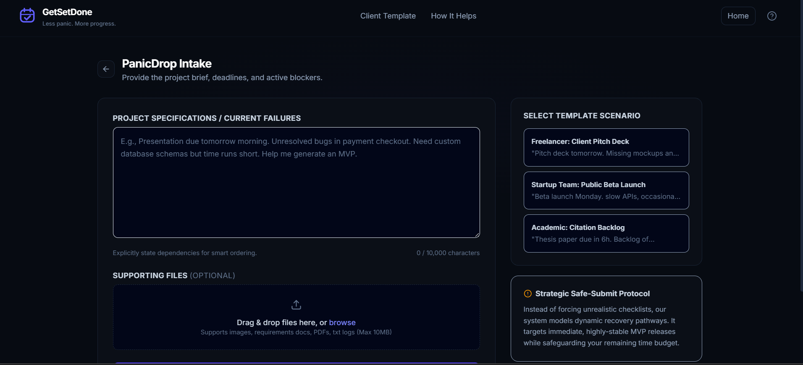

<div align="center">

# ✅ GetSetDone

### Less panic. More progress.

**Plan your day. Recover when deadlines go wrong. Submit with confidence.**

<br/>

<a href="https://getsetdone-54643555977.asia-southeast1.run.app/">
  
</a>

<br/>
<br/>

**Live App:**
https://getsetdone-54643555977.asia-southeast1.run.app/

<br/>


</div>

---

## 📌 Overview

**GetSetDone** is an AI-powered dual-mode productivity application that helps users stay organized every day and recover quickly when deadlines become risky.

It combines:

* **Daily Mode** — for habits, schedules, focus sessions, weekly goals, and normal productivity.
* **Rescue Mode** — for urgent deadlines, blockers, realistic recovery plans, proof tracking, and submission readiness.

The core idea is simple:

> **Stay on track every day. Get back on track when it matters most.**

---

## 🚀 Live Demo

<div align="center">

<a href="https://getsetdone-54643555977.asia-southeast1.run.app/">
  
</a>

</div>

---
<p align="center">
  
</p>
---
## 🎯 Problem Statement

Students, professionals, freelancers, and creators often miss deadlines because they do not know:

* what to do first,
* what can wait,
* what is blocking progress,
* how to recover when they fall behind,
* whether their work is actually ready to submit.

Most productivity tools act like passive reminders. They tell users that something is due, but they do not help users take meaningful action.

**GetSetDone solves this by turning deadline stress into a clear execution plan.**

---

## 💡 Solution

GetSetDone works as a personal execution system.

It helps users:

1. Plan daily routines.
2. Track habits and focus sessions.
3. Detect deadline risk.
4. Generate a realistic recovery plan.
5. Update the plan when stuck.
6. Add proof of completed work.
7. Check whether everything is ready to submit.

---

## ✨ Key Features

### 🧭 1. Daily Mode

Daily Mode helps users stay consistent before deadlines become stressful.

Features:

* Today’s schedule
* Habit tracker
* Focus sessions
* Weekly goals
* Progress summary
* Upcoming deadline awareness
* Milestones and rewards

---

### 🚨 2. Rescue Mode

Rescue Mode helps users when a deadline is close or work is blocked.

Features:

* Add deadline details
* Upload optional supporting file
* Generate deadline check
* View Best Plan to Finish
* View Full Plan
* View Backup Plan
* Update plan when stuck
* Add proof
* Track readiness to submit

---

### 🧠 3. AI Deadline Check

GetSetDone uses AI to analyze:

* deadline time,
* available time,
* task details,
* blockers,
* missing items,
* risk level,
* best next action.

The goal is to answer one question clearly:

> **What should I do next?**

---

### ✅ 4. Best Plan to Finish

Instead of showing a large generic task list, GetSetDone creates the smallest realistic plan that helps users complete something strong before the deadline.

Each task includes:

* task name,
* estimated time,
* importance level,
* status,
* proof option,
* simple explanation of why it matters.

---

### 🔁 5. I’m Stuck — Update My Plan

When the user gets blocked, GetSetDone updates the plan.

It can:

* remove low-priority tasks,
* reorder important work,
* suggest a backup path,
* update readiness score,
* explain why the plan changed.

---

### 📎 6. Add Proof

Users can save proof that work is complete.

Supported proof examples:

* deployed app link,
* GitHub link,
* document link,
* screenshot,
* PDF,
* short note.

This makes progress more reliable than simple checkboxes.

---

### 📊 7. Ready to Submit?

The readiness meter shows how close the user is to a complete submission.

It tracks:

* main work complete,
* proof added,
* problems fixed,
* enough time left.

---

### 🏆 8. Milestones

GetSetDone includes professional milestones to encourage consistency.

Examples:

* First Step
* Focus Builder
* Consistency Week
* Weekly Winner
* Plan Saver
* Proof Ready
* Deadline Defender
* Finish Strong
* Early Submitter

---

## 🛠️ Tech Stack

<div align="center">

### Frontend


<br/>
<br/>

### AI & Backend


<br/>
<br/>

### Storage & Deployment


</div>

---

## 🧩 Google Technologies Used

* **Google AI Studio** — used for building and publishing the application.
* **Gemini API** — used for AI-powered deadline analysis and planning.
* **Google Cloud Run** — used for deployment.

---

## 📂 File Upload Support

GetSetDone supports optional requirement files during deadline planning.

Supported file types:

```text
.pdf
.png
.jpg
.jpeg
.webp
.txt
.md
.mp3
.wav
.m4a
```

Maximum file size:

```text
10 MB
```

If file analysis fails, the user can still continue with text-only planning.

---

## 🧱 Architecture

```text
GetSetDone
│
├── User Onboarding
│   └── Local name-based workspace
│
├── Daily Mode
│   ├── Today’s Schedule
│   ├── Habits
│   ├── Focus Sessions
│   ├── Weekly Goals
│   └── Milestones
│
├── Rescue Mode
│   ├── Add Your Deadline
│   ├── Deadline Check
│   ├── Best Plan to Finish
│   ├── Full Plan
│   ├── Backup Plan
│   ├── Add Proof
│   ├── Ready to Submit
│   └── Submission Checklist
│
├── AI Layer
│   ├── Gemini deadline analysis
│   ├── Retry handling
│   ├── Fallback planning
│   └── Structured output validation
│
├── Storage Layer
│   └── Browser localStorage
│
└── Deployment
    └── Google Cloud Run
```

---

## 🧪 Main User Flow

### First-Time Flow

```text
Open app
→ Enter name
→ Workspace opens
→ Choose Daily Mode or Rescue Mode
```

### Daily Mode Flow

```text
Plan today
→ Add habits
→ Start focus session
→ Track progress
→ Watch upcoming deadlines
```

### Rescue Mode Flow

```text
Add deadline
→ Get Deadline Check
→ View Best Plan to Finish
→ Update plan if stuck
→ Add proof
→ Check readiness
→ Submit confidently
```

---

## 🖥️ Screenshots

Add screenshots inside a `screenshots` folder and update these image paths.

```html
<p align="center">
  
</p>

<p align="center">
  
</p>

<p align="center">
  
</p>

<p align="center">
  
</p>
```

---

## ⚙️ Local Setup

### 1. Clone Repository

```bash
git clone https://github.com/YOUR_USERNAME/getsetdone-ai.git
cd getsetdone-ai
```

### 2. Install Dependencies

```bash
npm install
```

### 3. Add Environment Variable

Create a `.env` file:

```env
GEMINI_API_KEY=your_gemini_api_key_here
```

Never commit `.env` to GitHub.

### 4. Run Development Server

```bash
npm run dev
```

### 5. Build Production App

```bash
npm run build
```

### 6. Run Lint

```bash
npm run lint
```

---

## 🔐 Security Notes

* Gemini API key is handled server-side.
* API keys should not be exposed in frontend code.
* Uploaded files are not permanently stored.
* User workspace data is stored locally in the browser.
* No Firebase or account authentication is used in the current MVP.
* The app uses localStorage for a fast local-first experience.

---

## 🧯 Error Handling

GetSetDone handles:

* empty input,
* invalid deadline,
* past deadline,
* oversized file upload,
* unsupported file type,
* AI service failure,
* localStorage issues,
* repeated button clicks,
* mobile layout overflow,
* browser refresh persistence.

If AI analysis is unavailable, the app can continue with a backup planning flow.

---

## 🎤 Demo Script

Use this while presenting the project:

1. Open the live GetSetDone app.
2. Enter your name.
3. Show Daily Mode.
4. Add or show a habit, schedule block, or focus session.
5. Switch to Rescue Mode.
6. Add a deadline with limited time and a blocker.
7. Generate the Deadline Check.
8. Show the Best Plan to Finish.
9. Click **I’m Stuck — Update My Plan**.
10. Show the updated Backup Plan.
11. Add proof such as a GitHub or deployed app link.
12. Show the Ready to Submit percentage improving.
13. Open the Submission Checklist.
14. Explain the core message:

> GetSetDone helps users stay on track every day and recover when deadlines become risky.

---

## 🏁 Why GetSetDone Is Different

Most productivity apps remind users about deadlines.

GetSetDone helps users act before the deadline is lost.

It answers:

* What should I do first?
* What can wait?
* What is blocking me?
* What is the realistic plan?
* What proof is missing?
* Am I ready to submit?

---

## 🚧 Current Limitations

* Data is stored only in the browser.
* No cross-device sync yet.
* No Firebase authentication in the current version.
* No real Google Calendar sync yet.
* AI responses depend on Gemini API availability.
* Uploaded files are not permanently saved.

---

## 🔮 Future Scope

* Firebase Authentication
* Firestore cloud sync
* Google Calendar integration
* Browser notifications
* Team collaboration
* Mobile app version
* Exportable productivity reports
* Advanced deadline prediction
* Smarter file parsing

---

## 📌 Project Status

Current version includes:

* Live deployed app
* Local user onboarding
* Daily Mode
* Rescue Mode
* AI-powered deadline planning
* File upload validation
* Local fallback planning
* Proof tracking
* Readiness scoring
* Habits and focus sessions
* Milestones
* Google Cloud deployment

---

## 👩‍💻 Author

Built by **Janani** for the **Vibe2Ship Hackathon**.

---

## 📄 License

This project is created for hackathon and learning purposes.

---
